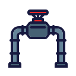

<a name="readme-top"></a>
<div align="center">
  <!-- Logo -->
  <a href="https://github.com/dpetrosy/42-Pipex">
  
  </a>

  <!-- Project Name -->
  <h1>Pipex Project</h1>

  <!-- Short Description -->
  <p align="center">
	  <b>42 Yerevan Pipex</b><br>
	  For further information about 42cursus and its projects, please refer to <a href="https://github.com/dpetrosy/42cursus"><b>42cursus repo</b></a>.
  </p>

  <!-- Badges -->
  <p>
    
    
    
    
    
  </p>

  <h3>
      <a href="#-about-project">📜 About Project</a>
    <span> · </span>
      <a href="#-mandatory-part">🔷 Mandatory Part</a>
    <span> · </span>
	  <a href="#-bonus-part">🌟 Bonus Part</a>
    <span> · </span>
      <a href="#-usage">👨‍💻 Usage</a>
  </h3>
</div>

---

## 📜 About Project

> This pipex program takes an input file, performs a command on it, pipes the result to another command which then writes its result to an output file. The result is virtually identical to this kind of shell command.

For detailed information, refer to the [**subject of this project**](README_files/push_swap_subject.pdf).

	🚀 TLDR: Pipex is a 42 School project aimed to better understand shell redirection and pipes,
           by handling them in C.

## 🔷 Mandatory Part

The program `pipex` should repeat the behavior of the next shell command:
```bash
$> < file1 cmd1 | cmd2 > file2
```
and looks like this:
```bash
$> ./pipex file1 cmd1 cmd2 file2
```

> [!NOTE]  
> All errors like: wrong commands,  permission to files and etc are handled.

## 🌟 Bonus Part

Program needs to handle multiple pipes:
```bash
$> < file1 cmd1 | cmd2 | cmd3 | ... | cmdn > file2
```

and looks like this:
```bash
$> ./pipex file1 cmd1 cmd2 cmd3 ... cmdn file2
```

## 👨‍💻 Usage
### Requirements

The program is written in C language and thus needs the **gcc compiler** and some standard **C libraries** to run.

### Instructions

**1. Compiling the program**

To compile the program, run:

```shell
$ cd path/to/push_swap && make
```

**2. How to run the program**

Run the executable with some commands of your choice:
```shell
./pipex input "cat" "wc -l" output
```

Use `clean` to delete all object files, `fclean` to remove executable and all object files, and `re` to recompile the program:
```shell
make clean / make fclean / make re
```
